# 学习通状态流转图说明

## 1. 文档说明

- 项目名称：学习通管理项目
- 文档版本：V1.1
- 编写日期：2026-04-24
- 对应文档：`docs/需求设计文档/学习通需求文档.md`
- 对应文档：`docs/需求设计文档/学习通状态枚举字典与字段约束说明.md`
- 对应文档：`docs/需求设计文档/学习通前后端枚举常量清单.md`
- 对应文档：`docs/需求设计文档/学习通数据库表设计初稿.md`
- 文档目的：对系统核心业务状态进行统一建模，明确状态节点、流转触发条件、不可逆规则和实现建议，作为后端状态机设计、前端页面呈现、接口校验和测试用例设计的依据。

## 2. 编写约定

| 项 | 说明 |
| --- | --- |
| 状态来源 | 所有状态值以 `docs/需求设计文档/学习通状态枚举字典与字段约束说明.md` 为准 |
| 图示语法 | 本文使用 Mermaid `stateDiagram-v2` 表达状态机 |
| 删除语义 | 逻辑删除 `is_deleted=1` 不视为业务状态流转，除非文中单独说明 |
| 并行状态 | 同一对象若存在多个状态维度，拆分为多张状态图说明，如审核状态和展示状态分开描述 |
| 重新开始 | 重新练习、重新发送、重新发起等场景，优先创建新记录，而不是回退旧记录，除非文中明确允许回退 |

## 3. 状态流转设计原则

1. 状态值必须与数据库字段、接口枚举和前端常量保持一致，不允许出现同义不同值。
2. 一个对象若存在生命周期状态和处理结果状态，应拆分不同字段管理，避免一个字段承载多重语义。
3. 高风险流转如上架、审核、退款、封禁、举报处理必须记录操作人、操作时间和操作原因。
4. 已完成型状态如“已发送”“已批改”“已关闭”原则上不直接回退，若业务需要重开，建议创建新记录或通过专门动作重开。
5. 前端展示文案可根据状态值映射中文标签，但流转判断必须以英文状态值为准。

## 4. 状态流转总览

| 流转对象 | 核心状态字段 | 主要触发方 | 说明 |
| --- | --- | --- | --- |
| 用户账号 | `sys_user.status` | 管理员、系统 | 账号启用与禁用 |
| 验证码 | `auth_verify_code.status` | 用户、系统 | 找回密码验证码生命周期 |
| 登录会话 | `auth_session.status` | 用户、系统 | 登录态有效、过期、退出 |
| 课程 | `edu_course.status` | 管理员、审核流程 | 草稿、待审、上架、下架 |
| 课程章节 | `edu_course_chapter.status` | 管理员 | 章节草稿、发布、下线 |
| 课程评价 | `edu_course_evaluation.status` | 用户、管理员 | 可见、隐藏、删除 |
| 园地内容审核 | `garden_content.audit_status` | 管理员、审核流程 | 待审、通过、拒绝 |
| 园地内容展示 | `garden_content.status` | 管理员 | 可见、隐藏、下线 |
| 会员状态 | `user_member_record.status` | 用户、管理员、系统 | 正常、即将到期、过期、取消 |
| 支付状态 | `member_renewal_record.pay_status` | 用户、支付系统 | 待支付、已支付、失败、退款 |
| 学习记录 | `user_study_record.status` | 用户、系统 | 学习中、已完成 |
| 下载任务 | `user_offline_download.download_status` | 用户、系统 | 待下载、下载中、完成、失败 |
| 练习记录 | `user_practice_record.practice_status` | 用户、系统 | 未开始、进行中、已提交、已批改 |
| 错题记录 | `user_wrong_question.status` | 用户、系统 | 生效中、已掌握 |
| 消息发送 | `sys_message.send_status` | 管理员、系统 | 草稿、待定时、已发送、失败 |
| 消息送达/已读 | `sys_message_receiver.deliver_status`、`read_status` | 系统、用户 | 送达成功与已读拆分管理 |
| 客服工单 | `service_ticket.ticket_status` | 用户、客服、系统 | 待处理、处理中、已解决、已关闭 |
| 举报处理 | `risk_report_record.status` | 用户、管理员 | 待处理、处理中、已处理、已驳回 |

## 5. 核心状态流转图说明

### 5.1 用户账号状态流转

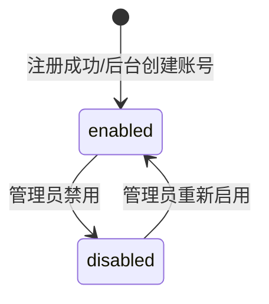

| 触发动作 | 起始状态 | 目标状态 | 说明 |
| --- | --- | --- | --- |
| 用户注册成功 | 无 | `enabled` | 默认生成可用账号 |
| 管理员新增用户 | 无 | `enabled` | 默认启用，可根据后台策略改为禁用 |
| 管理员禁用账号 | `enabled` | `disabled` | 禁用后应阻止登录和关键业务操作 |
| 管理员启用账号 | `disabled` | `enabled` | 恢复前台或后台使用权限 |

- 实现建议：逻辑删除与禁用分开处理，删除账号不应通过状态字段表达。

### 5.2 找回密码验证码状态流转

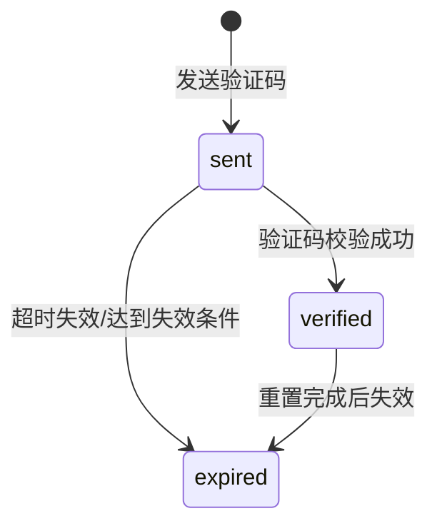

| 触发动作 | 起始状态 | 目标状态 | 说明 |
| --- | --- | --- | --- |
| 发送验证码 | 无 | `sent` | 生成验证码记录 |
| 校验验证码成功 | `sent` | `verified` | 获取 `verify_token` |
| 超时未使用 | `sent` | `expired` | 系统定时任务或校验时置过期 |
| 密码重置成功 | `verified` | `expired` | 防止重复使用 |

- 实现建议：重新发送验证码建议创建新记录，不建议回写已过期记录为 `sent`。

### 5.3 登录会话状态流转

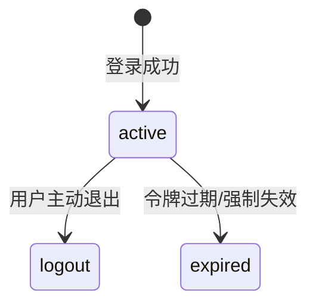

| 触发动作 | 起始状态 | 目标状态 | 说明 |
| --- | --- | --- | --- |
| 登录成功 | 无 | `active` | 创建登录态 |
| 用户退出登录 | `active` | `logout` | 主动结束会话 |
| Token 过期 | `active` | `expired` | 由系统按过期时间处理 |
| 管理员强制下线 | `active` | `expired` | 与过期统一处理会话失效 |

### 5.4 课程状态流转

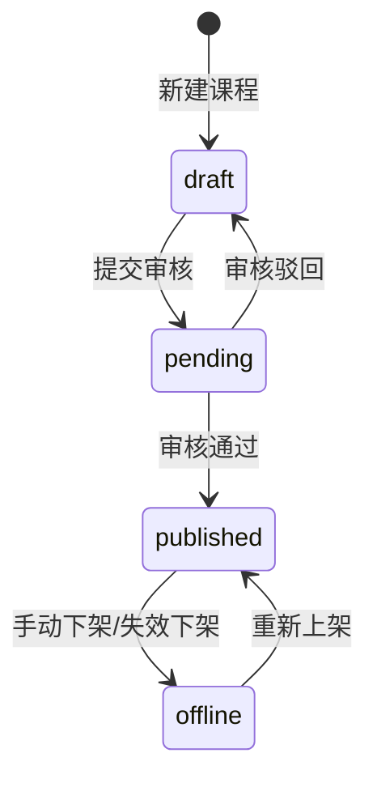

| 触发动作 | 起始状态 | 目标状态 | 说明 |
| --- | --- | --- | --- |
| 新建课程 | 无 | `draft` | 初始草稿态 |
| 提交审核 | `draft` | `pending` | 进入审核 |
| 审核通过 | `pending` | `published` | 课程可前台展示 |
| 审核驳回 | `pending` | `draft` | 退回编辑 |
| 手动下架 | `published` | `offline` | 暂停前台展示 |
| 重新上架 | `offline` | `published` | 恢复前台展示 |

- 实现建议：若首版不做审核流，可临时允许 `draft -> published`，但数据库状态仍建议保留 `pending`。

### 5.5 课程章节状态流转

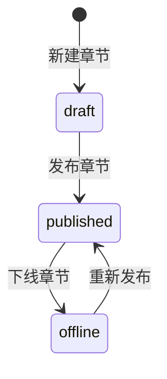

| 触发动作 | 起始状态 | 目标状态 | 说明 |
| --- | --- | --- | --- |
| 新增章节 | 无 | `draft` | 章节默认未发布 |
| 发布章节 | `draft` | `published` | 前台课程详情可见 |
| 下线章节 | `published` | `offline` | 停止展示或学习 |
| 重新发布 | `offline` | `published` | 恢复展示 |

### 5.6 课程评价状态流转

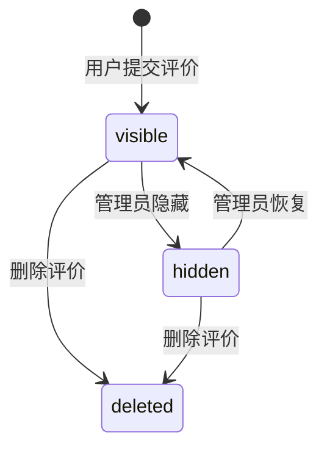

| 触发动作 | 起始状态 | 目标状态 | 说明 |
| --- | --- | --- | --- |
| 用户评价成功 | 无 | `visible` | 默认前台可见 |
| 管理员隐藏 | `visible` | `hidden` | 不在前台展示 |
| 管理员恢复 | `hidden` | `visible` | 重新前台可见 |
| 删除评价 | `visible` / `hidden` | `deleted` | 终态，通常伴随逻辑删除 |

### 5.7 园地内容审核状态流转

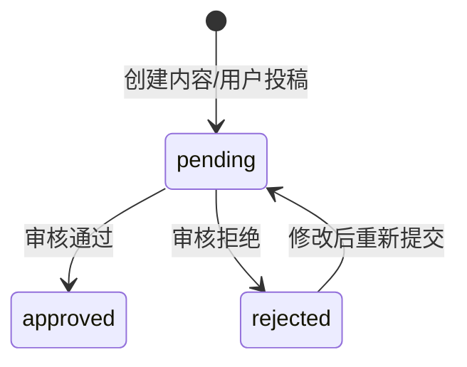

| 触发动作 | 起始状态 | 目标状态 | 说明 |
| --- | --- | --- | --- |
| 创建内容 | 无 | `pending` | 后台发布或用户投稿均可先入待审 |
| 审核通过 | `pending` | `approved` | 可进入展示状态 |
| 审核拒绝 | `pending` | `rejected` | 不可展示 |
| 修改重提 | `rejected` | `pending` | 再次进入审核 |

### 5.8 园地内容展示状态流转

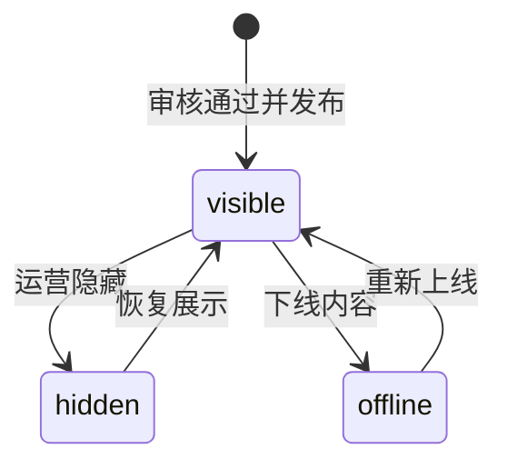

| 触发动作 | 起始状态 | 目标状态 | 说明 |
| --- | --- | --- | --- |
| 审核通过并发布 | 无 | `visible` | 默认前台可见 |
| 运营隐藏 | `visible` | `hidden` | 临时隐藏，不代表删除 |
| 恢复展示 | `hidden` | `visible` | 再次对外展示 |
| 下线内容 | `visible` | `offline` | 停止展示 |
| 重新上线 | `offline` | `visible` | 恢复前台展示 |

### 5.9 会员支付状态流转

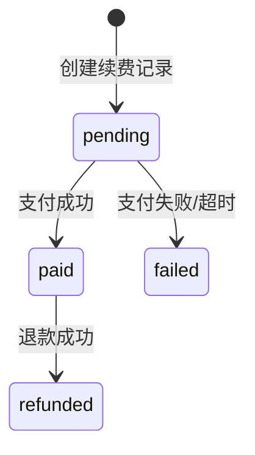

| 触发动作 | 起始状态 | 目标状态 | 说明 |
| --- | --- | --- | --- |
| 创建订单/续费记录 | 无 | `pending` | 等待支付 |
| 支付成功回调 | `pending` | `paid` | 驱动会员状态生效 |
| 支付失败或关闭 | `pending` | `failed` | 订单未完成 |
| 退款成功 | `paid` | `refunded` | 后续需联动会员状态调整 |

### 5.10 会员状态流转

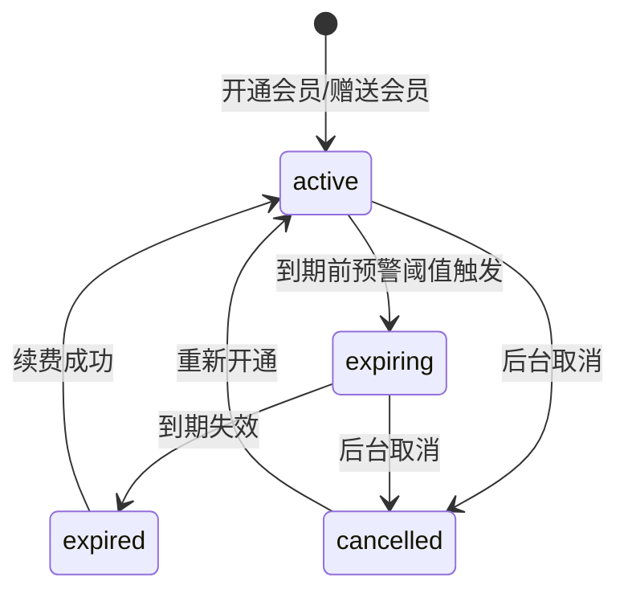

| 触发动作 | 起始状态 | 目标状态 | 说明 |
| --- | --- | --- | --- |
| 开通/赠送会员 | 无 | `active` | 新会员生效 |
| 到期预警 | `active` | `expiring` | 接近到期时间 |
| 到期失效 | `expiring` | `expired` | 自动失效 |
| 后台取消 | `active` / `expiring` | `cancelled` | 人工取消资格 |
| 再次续费/开通 | `expired` / `cancelled` | `active` | 恢复会员权益 |

### 5.11 成长任务状态流转

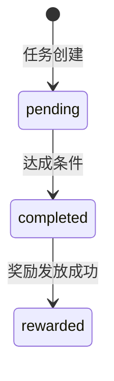

| 触发动作 | 起始状态 | 目标状态 | 说明 |
| --- | --- | --- | --- |
| 任务生成 | 无 | `pending` | 按日或按事件生成 |
| 达成目标 | `pending` | `completed` | 满足签到、学习、练习条件 |
| 发放奖励 | `completed` | `rewarded` | 奖励到账 |

- 实现建议：奖励失败建议通过 `reward_status` 单独记录，不建议把 `task_status` 回退为 `pending`。

### 5.12 学习记录状态流转

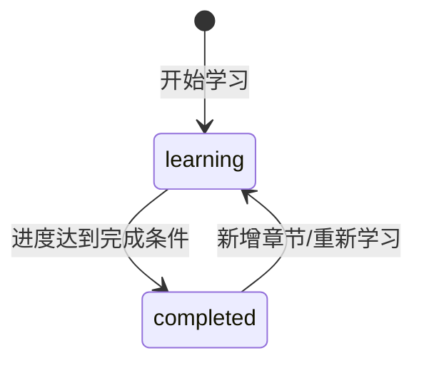

| 触发动作 | 起始状态 | 目标状态 | 说明 |
| --- | --- | --- | --- |
| 开始学习课程 | 无 | `learning` | 创建学习记录 |
| 完成课程 | `learning` | `completed` | 进度达到 100% 或满足完课条件 |
| 重新进入学习 | `completed` | `learning` | 课程更新或用户重新学习 |

### 5.13 离线下载状态流转

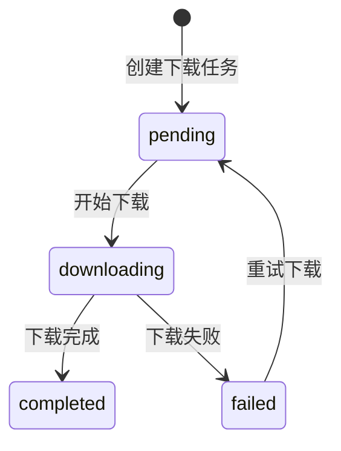

| 触发动作 | 起始状态 | 目标状态 | 说明 |
| --- | --- | --- | --- |
| 创建下载任务 | 无 | `pending` | 用户点击下载 |
| 开始下载 | `pending` | `downloading` | 客户端或服务启动任务 |
| 下载成功 | `downloading` | `completed` | 下载结束 |
| 下载失败 | `downloading` | `failed` | 网络或存储异常 |
| 重新尝试 | `failed` | `pending` | 创建重试流程 |

### 5.14 题库、题目、试卷配置状态流转

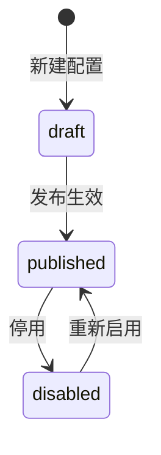

| 适用对象 | 状态字段 | 说明 |
| --- | --- | --- |
| 题库 | `practice_question_bank.status` | 管理题库是否可用 |
| 题目 | `practice_question.status` | 管理题目是否可出现在试卷中 |
| 试卷 | `practice_paper.status` | 管理试卷是否可被用户作答 |

### 5.15 练习记录状态流转

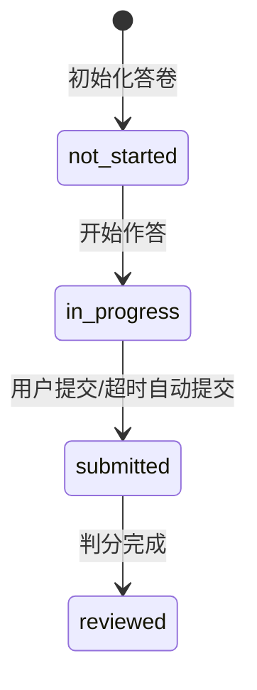

| 触发动作 | 起始状态 | 目标状态 | 说明 |
| --- | --- | --- | --- |
| 初始化练习记录 | 无 | `not_started` | 打开试卷或预创建记录 |
| 开始作答 | `not_started` | `in_progress` | 进入作答流程 |
| 提交答卷 | `in_progress` | `submitted` | 主动提交或超时系统提交 |
| 判分完成 | `submitted` | `reviewed` | 生成最终分数和解析 |

- 实现建议：用户重新练习时应创建新的 `user_practice_record`，不建议把 `reviewed` 回退成 `in_progress`。

### 5.16 错题状态流转

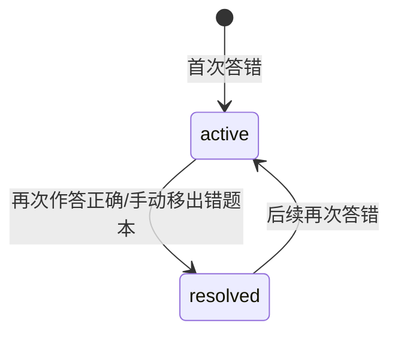

| 触发动作 | 起始状态 | 目标状态 | 说明 |
| --- | --- | --- | --- |
| 首次答错 | 无 | `active` | 进入错题本 |
| 掌握该题 | `active` | `resolved` | 再次练习正确或用户手动移除 |
| 再次答错 | `resolved` | `active` | 回到错题状态 |

### 5.17 消息发送状态流转

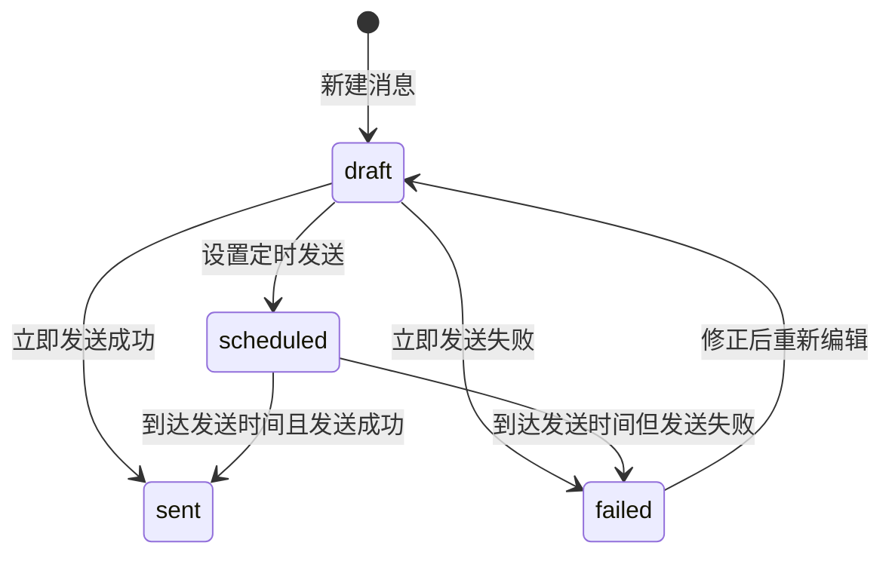

| 触发动作 | 起始状态 | 目标状态 | 说明 |
| --- | --- | --- | --- |
| 创建消息 | 无 | `draft` | 尚未发送 |
| 设置定时 | `draft` | `scheduled` | 待系统任务发送 |
| 立即发送成功 | `draft` | `sent` | 发送完成 |
| 立即发送失败 | `draft` | `failed` | 发送异常 |
| 定时成功 | `scheduled` | `sent` | 定时发送完成 |
| 定时失败 | `scheduled` | `failed` | 调度失败 |
| 重新编辑后重发 | `failed` | `draft` | 修正内容或对象后再次发送 |

### 5.18 消息送达与已读状态流转

#### 5.18.1 送达状态

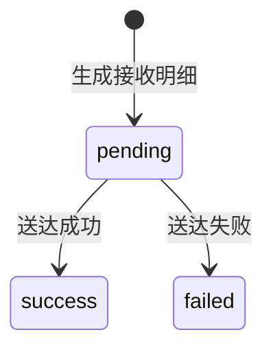

#### 5.18.2 已读状态

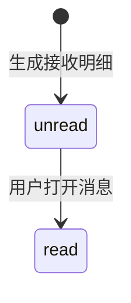

| 说明项 | 说明 |
| --- | --- |
| `deliver_status` | 描述消息是否成功送达到某个渠道或某个用户 |
| `read_status` | 描述用户是否已查看消息 |
| 设计原则 | 送达成功不代表已读，两者必须拆分字段管理 |

### 5.19 客服工单状态流转

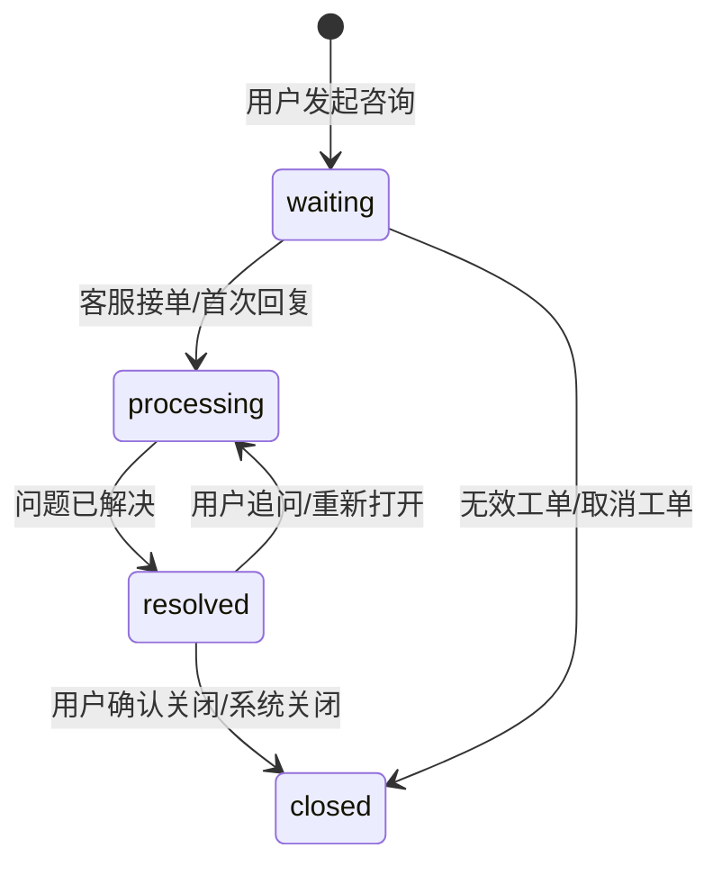

| 触发动作 | 起始状态 | 目标状态 | 说明 |
| --- | --- | --- | --- |
| 用户发起工单 | 无 | `waiting` | 进入待处理队列 |
| 客服首次响应 | `waiting` | `processing` | 工单进入处理中 |
| 问题解决 | `processing` | `resolved` | 客服确认已解决 |
| 用户确认关闭 | `resolved` | `closed` | 关闭工单 |
| 用户继续追问 | `resolved` | `processing` | 工单重开 |
| 无效或取消 | `waiting` | `closed` | 未进入有效处理流程即关闭 |

### 5.20 举报处理状态流转

```mermaid
stateDiagram-v2
    [*] --> pending: 用户提交举报
    pending --> processing: 管理员接单处理
    processing --> resolved: 处理完成
    processing --> rejected: 驳回举报
    resolved --> processing: 申诉复核/升级处理
```

| 触发动作 | 起始状态 | 目标状态 | 说明 |
| --- | --- | --- | --- |
| 用户举报 | 无 | `pending` | 生成举报记录 |
| 开始处理 | `pending` | `processing` | 管理员进入处理中 |
| 处理完成 | `processing` | `resolved` | 删除内容、封禁账号、警告等 |
| 驳回举报 | `processing` | `rejected` | 认定举报不成立 |
| 复核升级 | `resolved` | `processing` | 二次处理或申诉 |

### 5.21 启停类配置状态流转

以下对象可共用简单启停状态机：

- `member_plan.status`
- `growth_task_rule.status`
- `garden_content_source.status`
- `service_faq.status`
- `op_search_keyword.status`
- `cms_recommend_slot.status`
- `sys_sensitive_word.status`

```mermaid
stateDiagram-v2
    [*] --> enabled: 创建并启用
    enabled --> disabled: 手动停用
    disabled --> enabled: 重新启用
```

### 5.22 草稿-启用类配置状态流转

以下对象建议共用草稿-启用-停用状态机：

- `sys_message_template.status`

```mermaid
stateDiagram-v2
    [*] --> draft: 新建模板
    draft --> enabled: 启用模板
    enabled --> disabled: 停用模板
    disabled --> enabled: 重新启用
```

## 6. 实现落地建议

### 6.1 后端实现建议

1. 对课程上架、审核通过、支付成功、举报处理、工单关闭等关键流转统一走服务层方法，禁止控制器直接改状态。
2. 对消息发送、支付回调、定时任务、审核处理等流程增加幂等控制，避免重复流转。
3. 对 `pending -> approved`、`submitted -> reviewed`、`waiting -> processing` 这类关键步骤建议记录状态变更日志。
4. 对需要并行状态的对象，如消息送达与已读、园地审核与展示，禁止把多个含义塞到同一个字段。

### 6.2 前端实现建议

1. 所有页面状态标签、按钮显隐和操作禁用逻辑必须引用统一枚举常量，而不是写死字符串。
2. 对终态或不可操作态，如 `closed`、`deleted`、`sent`，前端应明确禁用不允许的按钮动作。
3. 对用户可见的关键流程建议展示状态时间，如会员到期时间、消息发送时间、工单解决时间、练习提交时间。

### 6.3 测试建议

1. 为每条流转补齐“正常流转”“非法流转”“重复提交”“并发重复操作”四类测试。
2. 对不可逆或高风险流程重点测试越权操作和重复操作，如重复退款、重复审核、重复发送。
3. 对自动流转流程增加定时任务测试，如验证码过期、会员即将到期、定时消息发送、工单超时关闭。

## 7. 待确认项

1. 课程、章节、题库、题目、试卷当前按简化状态机设计，若后续引入正式审核流，需要增加更多中间状态。
2. 工单当前按 `waiting -> processing -> resolved -> closed` 设计，若后续引入转派、挂起、超时升级，需要补充分支状态。
3. 举报处理当前允许 `resolved -> processing` 复核，若业务不支持申诉复审，可删除该回退分支。
4. 会员支付若接入真实支付平台，`pending -> failed` 之外还可能需要 `closed`、`cancelled` 等订单状态。

## 8. 后续建议

1. 继续把本文状态机同步到接口文档，为关键接口补充“允许的状态前置条件”。
2. 继续生成“状态流转测试用例清单”，把每个状态节点和非法流转覆盖到测试场景。
3. 若进入开发实施，可继续生成“状态变更日志表设计”或“审计事件清单”。
